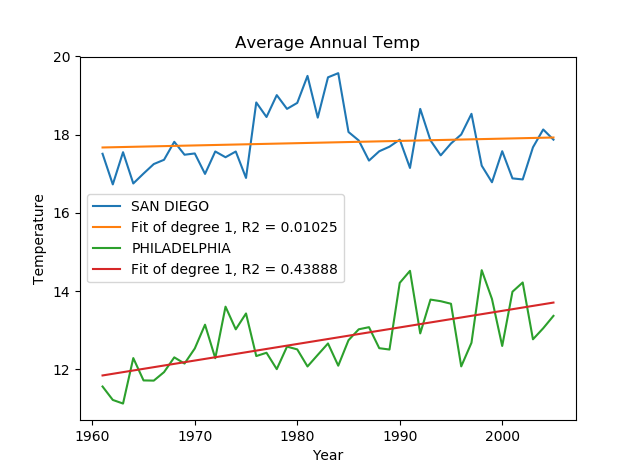

### Climate Change Regression Model

The script uses linear regression to identify evidence of climate change in longitudinal temperature data for cities in the USA. The figure below is an example of the output for San Diego and Philidelphia.

A full description of the problems is availble here: https://ocw.mit.edu/courses/sloan-school-of-management/15-071-the-analytics-edge-spring-2017/linear-regression/assignment-2/

**Example output** 
{:class="img-responsive"}

